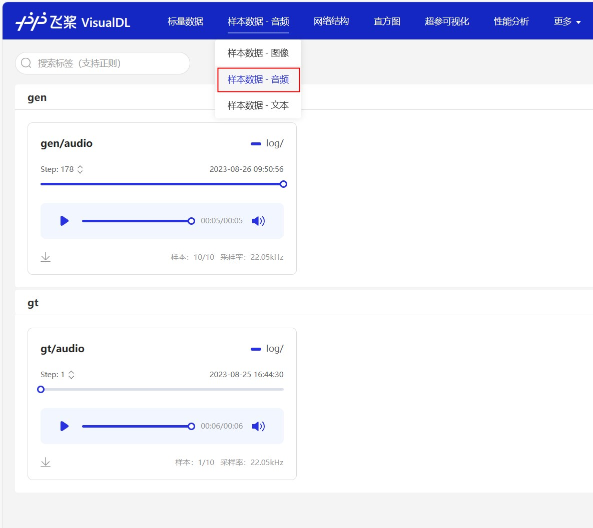

简体中文 | [English]()

# 基于Pytorch实现的语音合成系统


# 前言

本项目是基于Pytorch的语音合成项目，使用的是VITS，VITS（Variational Inference with adversarial learning for end-to-end Text-to-Speech）是一种语音合成方法，这种时端到端的模型使用起来非常简单，不需要文本对齐等太复杂的流程，直接一键训练和生成，大大降低了学习门槛。

**欢迎大家扫码入知识星球或者QQ群讨论，知识星球里面提供项目的模型文件和博主其他相关项目的模型文件，也包括其他一些资源。**

<div align="center">
  
  
</div>

# 使用准备

- Anaconda 3
- Python 3.8
- Pytorch 1.13.1
- Windows 10 or Ubuntu 18.04


# 模型下载

|                           数据集                            | 说话人数量 | 说话人名称 |                               下载地址                               | 
|:--------------------------------------------------------:|:-----:|:-----:|:----------------------------------------------------------------:|
| [BZNSYP](https://aistudio.baidu.com/datasetdetail/36741) |   1   | 标准女声  | [点击下载](https://pan.baidu.com/s/1tuHlcfUb0emeszLLD72aNg?pwd=9b5g) |

## 安装环境

- 首先安装的是Pytorch的GPU版本，如果已经安装过了，请跳过。

```shell
conda install pytorch==1.13.1 torchvision==0.14.1 torchaudio==0.13.1 pytorch-cuda=11.6 -c pytorch -c nvidia
```

- 安装mvits库。

使用pip安装，命令如下：

```shell
python -m pip install mvits -U -i https://pypi.tuna.tsinghua.edu.cn/simple
```

**建议源码安装**，源码安装能保证使用最新代码。

```shell
git clone https://github.com/yeyupiaoling/VITS-Pytorch.git
cd VITS-Pytorch/
python setup.py install
```

## 准备数据

项目支持直接生成[BZNSYP](https://aistudio.baidu.com/datasetdetail/36741)和[AiShell3](https://aistudio.baidu.com/datasetdetail/207703)数据列表，以BZNSYP为例，将BZNSYP下载到`dataset`目录下，并解压。然后执行`create_list.py`程序就会生成以下格式的数据表，格式为`<音频路径>|<说话人名称>|<标注数据>`，注意标注数据需要标注语言，例如简体中文，就要用`[ZH]`将文本包裹起来，其他语言分别支持日本語:`[JA]`, English:[EN], 한국어:[KO]。自定义数据集按照这个格式生成就行。
```
dataset/BZNSYP/Wave/000001.wav|标准女声|[ZH]卡尔普陪外孙玩滑梯。[ZH]
dataset/BZNSYP/Wave/000002.wav|标准女声|[ZH]假语村言别再拥抱我。[ZH]
dataset/BZNSYP/Wave/000003.wav|标准女声|[ZH]宝马配挂跛骡鞍，貂蝉怨枕董翁榻。[ZH]
```

有了数据列表之后，需要生成音素数据列表，只要执行`preprocess_data.py --train_data_list=dataset/bznsyp.txt`，即可生成音素数据列表。到这一步数据就全部准备好了。
```
dataset/BZNSYP/Wave/000001.wav|0|kʰa↓↑əɹ`↓↑pʰu↓↑ pʰeɪ↑ waɪ↓swən→ wan↑ xwa↑tʰi→.
dataset/BZNSYP/Wave/000002.wav|0|tʃ⁼ja↓↑ɥ↓↑ tsʰwən→jɛn↑p⁼iɛ↑ ts⁼aɪ↓ jʊŋ→p⁼ɑʊ↓ wo↓↑.
dataset/BZNSYP/Wave/000003.wav|0|p⁼ɑʊ↓↑ma↓↑ pʰeɪ↓k⁼wa↓ p⁼wo↓↑ lwo↑an→, t⁼iɑʊ→ts`ʰan↑ ɥæn↓ ts`⁼ən↓↑ t⁼ʊŋ↓↑ʊŋ→ tʰa↓.
```


## 训练

现在就可以开始训练模型了，配置文件里面的参数一般不需要修改，说话人数量和说话人名称都会在执行`preprocess_data.py`修改过。可能需要修改的只有`train.batch_size`，如果是显存不够的话，可以减小这个参数。

```shell
# 单卡训练
CUDA_VISIBLE_DEVICES=0 python train.py
# 多卡训练
CUDA_VISIBLE_DEVICES=0,1 torchrun --standalone --nnodes=1 --nproc_per_node=2 train.py
```

训练输出日志：

```
[2023-08-28 17:04:42.274452 INFO   ] utils:print_arguments:123 - ----------- 额外配置参数 -----------
[2023-08-28 17:04:42.274540 INFO   ] utils:print_arguments:125 - config: configs/config.yml
[2023-08-28 17:04:42.274580 INFO   ] utils:print_arguments:125 - epochs: 10000
[2023-08-28 17:04:42.274658 INFO   ] utils:print_arguments:125 - model_dir: models
[2023-08-28 17:04:42.274702 INFO   ] utils:print_arguments:125 - pretrained_model: None
[2023-08-28 17:04:42.274746 INFO   ] utils:print_arguments:125 - resume_model: None
[2023-08-28 17:04:42.274788 INFO   ] utils:print_arguments:126 - ------------------------------------------------
[2023-08-28 17:04:42.727728 INFO   ] utils:print_arguments:128 - ----------- 配置文件参数 -----------
[2023-08-28 17:04:42.727836 INFO   ] utils:print_arguments:131 - dataset_conf:
[2023-08-28 17:04:42.727909 INFO   ] utils:print_arguments:138 -        add_blank: True
[2023-08-28 17:04:42.727975 INFO   ] utils:print_arguments:138 -        batch_size: 16
[2023-08-28 17:04:42.728037 INFO   ] utils:print_arguments:138 -        cleaned_text: True
[2023-08-28 17:04:42.728097 INFO   ] utils:print_arguments:138 -        eval_sum: 2
[2023-08-28 17:04:42.728157 INFO   ] utils:print_arguments:138 -        filter_length: 1024
[2023-08-28 17:04:42.728204 INFO   ] utils:print_arguments:138 -        hop_length: 256
[2023-08-28 17:04:42.728235 INFO   ] utils:print_arguments:138 -        max_wav_value: 32768.0
[2023-08-28 17:04:42.728266 INFO   ] utils:print_arguments:138 -        mel_fmax: None
[2023-08-28 17:04:42.728298 INFO   ] utils:print_arguments:138 -        mel_fmin: 0.0
[2023-08-28 17:04:42.728328 INFO   ] utils:print_arguments:138 -        n_mel_channels: 80
[2023-08-28 17:04:42.728359 INFO   ] utils:print_arguments:138 -        num_workers: 4
[2023-08-28 17:04:42.728388 INFO   ] utils:print_arguments:138 -        sampling_rate: 22050
[2023-08-28 17:04:42.728418 INFO   ] utils:print_arguments:138 -        speakers_file: dataset/speakers.json
[2023-08-28 17:04:42.728448 INFO   ] utils:print_arguments:138 -        text_cleaner: cjke_cleaners2
[2023-08-28 17:04:42.728483 INFO   ] utils:print_arguments:138 -        training_file: dataset/train.txt
[2023-08-28 17:04:42.728539 INFO   ] utils:print_arguments:138 -        validation_file: dataset/val.txt
[2023-08-28 17:04:42.728585 INFO   ] utils:print_arguments:138 -        win_length: 1024
[2023-08-28 17:04:42.728615 INFO   ] utils:print_arguments:131 - model:
[2023-08-28 17:04:42.728648 INFO   ] utils:print_arguments:138 -        filter_channels: 768
[2023-08-28 17:04:42.728685 INFO   ] utils:print_arguments:138 -        gin_channels: 256
[2023-08-28 17:04:42.728717 INFO   ] utils:print_arguments:138 -        hidden_channels: 192
[2023-08-28 17:04:42.728747 INFO   ] utils:print_arguments:138 -        inter_channels: 192
[2023-08-28 17:04:42.728777 INFO   ] utils:print_arguments:138 -        kernel_size: 3
[2023-08-28 17:04:42.728808 INFO   ] utils:print_arguments:138 -        n_heads: 2
[2023-08-28 17:04:42.728839 INFO   ] utils:print_arguments:138 -        n_layers: 6
[2023-08-28 17:04:42.728870 INFO   ] utils:print_arguments:138 -        n_layers_q: 3
[2023-08-28 17:04:42.728902 INFO   ] utils:print_arguments:138 -        p_dropout: 0.1
[2023-08-28 17:04:42.728933 INFO   ] utils:print_arguments:138 -        resblock: 1
[2023-08-28 17:04:42.728965 INFO   ] utils:print_arguments:138 -        resblock_dilation_sizes: [[1, 3, 5], [1, 3, 5], [1, 3, 5]]
[2023-08-28 17:04:42.728997 INFO   ] utils:print_arguments:138 -        resblock_kernel_sizes: [3, 7, 11]
[2023-08-28 17:04:42.729027 INFO   ] utils:print_arguments:138 -        upsample_initial_channel: 512
[2023-08-28 17:04:42.729058 INFO   ] utils:print_arguments:138 -        upsample_kernel_sizes: [16, 16, 4, 4]
[2023-08-28 17:04:42.729089 INFO   ] utils:print_arguments:138 -        upsample_rates: [8, 8, 2, 2]
[2023-08-28 17:04:42.729119 INFO   ] utils:print_arguments:138 -        use_spectral_norm: False
[2023-08-28 17:04:42.729150 INFO   ] utils:print_arguments:131 - optimizer_conf:
[2023-08-28 17:04:42.729184 INFO   ] utils:print_arguments:138 -        betas: [0.8, 0.99]
[2023-08-28 17:04:42.729217 INFO   ] utils:print_arguments:138 -        eps: 1e-09
[2023-08-28 17:04:42.729249 INFO   ] utils:print_arguments:138 -        learning_rate: 0.0002
[2023-08-28 17:04:42.729280 INFO   ] utils:print_arguments:138 -        optimizer: AdamW
[2023-08-28 17:04:42.729311 INFO   ] utils:print_arguments:138 -        scheduler: ExponentialLR
[2023-08-28 17:04:42.729341 INFO   ] utils:print_arguments:134 -        scheduler_args:
[2023-08-28 17:04:42.729373 INFO   ] utils:print_arguments:136 -                gamma: 0.999875
[2023-08-28 17:04:42.729404 INFO   ] utils:print_arguments:131 - train_conf:
[2023-08-28 17:04:42.729437 INFO   ] utils:print_arguments:138 -        c_kl: 1.0
[2023-08-28 17:04:42.729467 INFO   ] utils:print_arguments:138 -        c_mel: 45
[2023-08-28 17:04:42.729498 INFO   ] utils:print_arguments:138 -        enable_amp: True
[2023-08-28 17:04:42.729530 INFO   ] utils:print_arguments:138 -        log_interval: 200
[2023-08-28 17:04:42.729561 INFO   ] utils:print_arguments:138 -        seed: 1234
[2023-08-28 17:04:42.729592 INFO   ] utils:print_arguments:138 -        segment_size: 8192
[2023-08-28 17:04:42.729622 INFO   ] utils:print_arguments:141 - ------------------------------------------------
[2023-08-28 17:04:42.729971 INFO   ] trainer:__init__:53 - 目前[cjke_cleaners2]只支持语言：['日本語', '普通话', 'English', '한국어']
[2023-08-28 17:04:42.795955 INFO   ] trainer:__setup_dataloader:119 - 训练数据：9984
epoch [1/10000]: 100%|██████████| 619/619 [05:30<00:00,  1.88it/s]]
[2023-08-25 16:44:25.205557 INFO   ] trainer:train:168 - ======================================================================
epoch [2/10000]: 100%|██████████| 619/619 [05:20<00:00,  1.93it/s]s]
[2023-08-25 16:49:54.372718 INFO   ] trainer:train:168 - ======================================================================
epoch [3/10000]: 100%|██████████| 619/619 [05:19<00:00,  1.94it/s]
[2023-08-25 16:55:21.277194 INFO   ] trainer:train:168 - ======================================================================
epoch [4/10000]: 100%|██████████| 619/619 [05:18<00:00,  1.94it/s]
```

训练的日志也会使用VisualDL保存，可以使用这个工具实时查看loss变化和合成效果，只要在项目根目录执行`visualdl --logdir=log/ --host=0.0.0.0`，访问`http://<IP地址>:8040`即可打开页面，效果如下。

<div align="center">
    
</div>

# 语音合成

训练到一定程度之后，可以开始使用模型进行语音合成了，命令如下，主要参数有三个，分别是`--language`指定合成文本的语言，然后是`--text`指定所需要合成的文本，最后是指定说话人的参数`--spk`。快去试一下吧。

```shell
python infer.py --language=简体中文 --text="你好，我是智能语音助手。" --spk=标准女声
```

## 打赏作者

<br/>
<div align="center">
    <p>打赏一块钱支持一下作者</p>
    
</div>

# 参考资料

1. https://github.com/Plachtaa/VITS-fast-fine-tuning
2. https://github.com/PaddlePaddle/PaddleSpeech
3. https://github.com/yeyupiaoling/MASR
4. https://github.com/Artrajz/vits-simple-api
